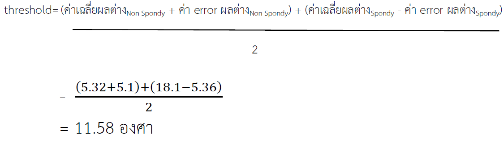
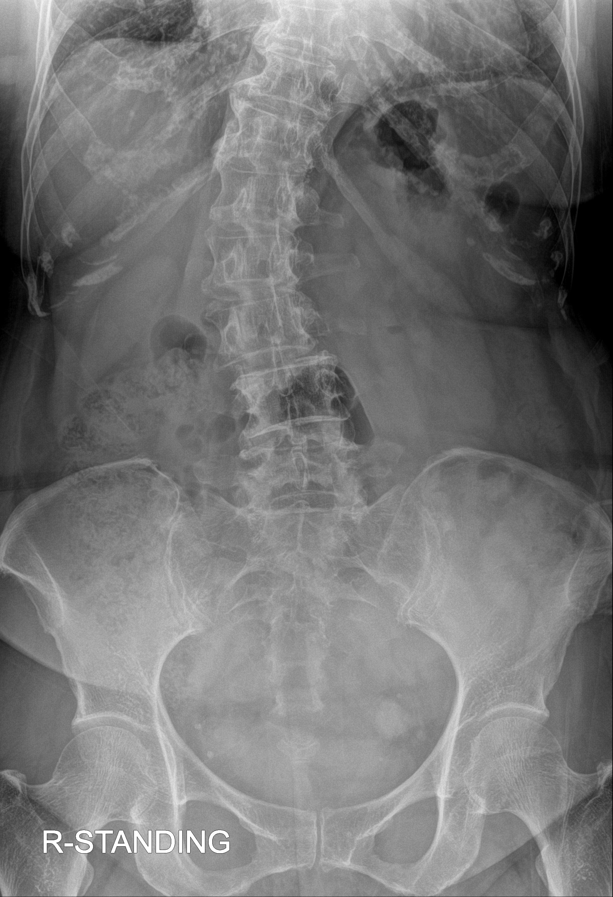
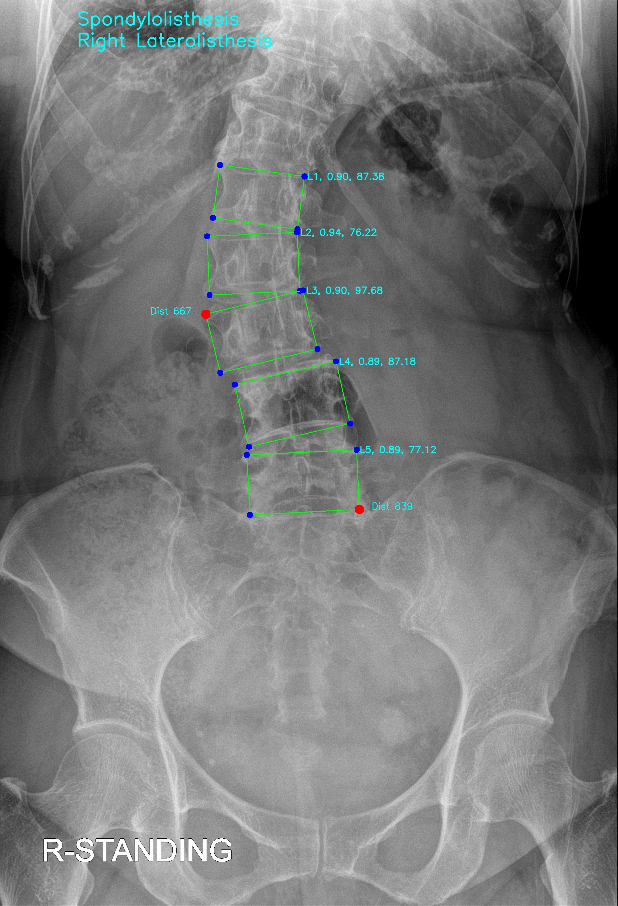
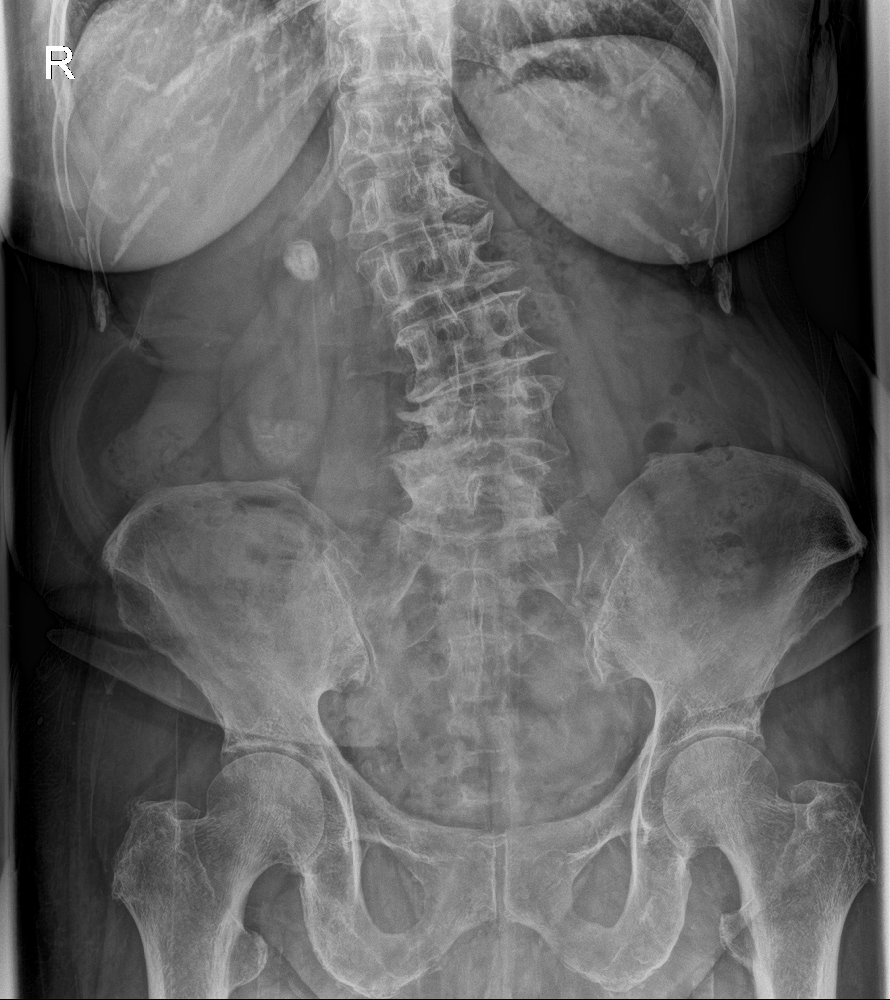
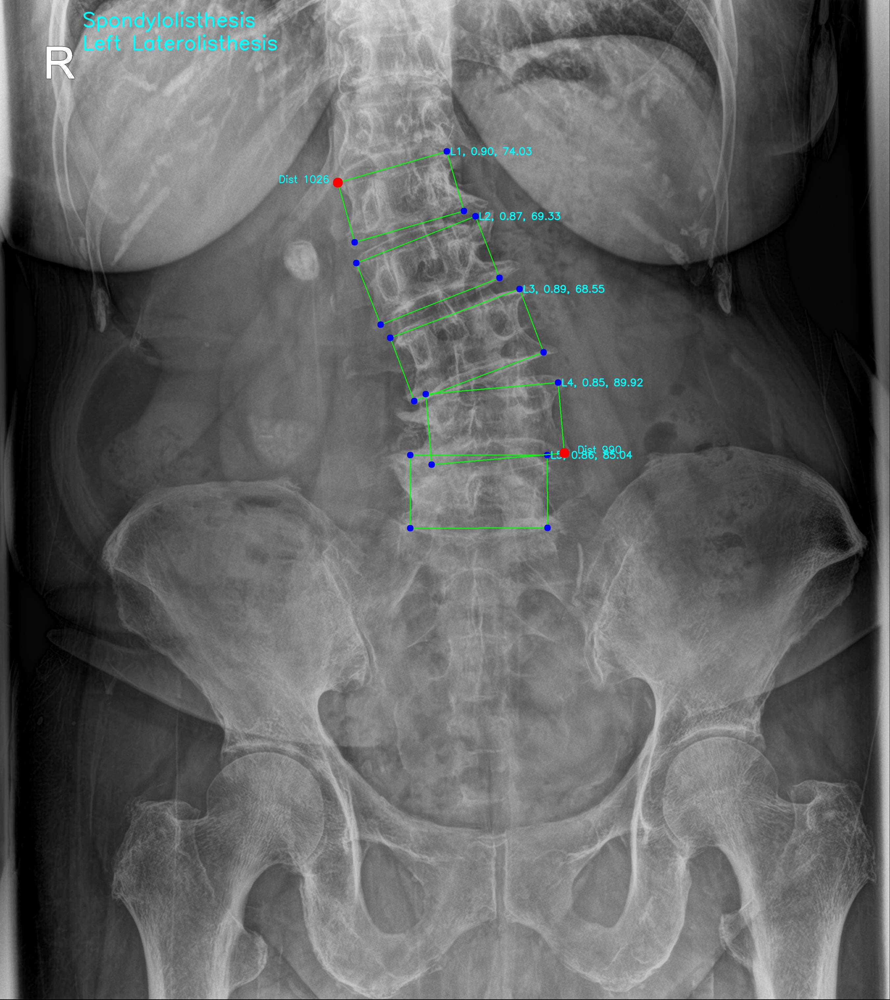

# Spondylolisthesis Detection 🩻

---

Spondylolisthesis detection from **X‑ray images** using a YOLO-based oriented bounding box (OBB) model.

## Table of contents
- [Model performance](#model-performance)
- [How it works](#how-it-works)
- [Install & Run](#install--run)
- [Example outputs](#example-outputs)
- [Contact](#contact)

---

## Model performance

<div align="center">
  
</div>

| Model | Mean Precision | Mean Recall | mAP@0.5 | mAP@0.5:0.95 |
|---|---:|---:|---:|---:|
| `AP_YOLO11_obb` | **0.97** | **0.98** | **0.99** | **0.93** |

---

## Equation for Diagnostic threshold & Performance

- **Threshold**
    <div align="center">
    
    </div>

- **Performance**
    | Diagnosed disease | Precision | Recall | F1-Score |
    |---|---:|---:|---:|
    | `Non-Spondylolisthesis`| 0.986 | 0.891 | 0.94 |
    | `Left Laterolisthesis`| 1.0 | 1.0 | 1.0 |
    | `Right Laterolisthesis`| 1.0 | 0.67 | 0.80 |

    **Accuracy** ≈ 0.890 or 89.0%

---

## How it works
1. The model detects each vertebra as an **Oriented Bounding Box (OBB)**.
2. Compute diagonal angles for each OBB and take the average angle per box.
3. If angle difference between vertebrae exceeds the threshold → classify as **Spondylolisthesis**.
4. Determine **Left** or **Right Laterolisthesis** by comparing distances to image borders.

---

## Install & Run
```bash
# clone repo
# install dependencies (recommend using venv)
python -m venv venv
venv\Scripts\activate  # Windows
pip install -r requirements.txt

# run detection on the example image
python main.py
```

> Note: `main.py` expects images in the `AP/` folder (paths in README use forward slashes).

The `main.py` file supports two model types: `pytorch` and `onnx`.

---

## Example outputs
| Class | X‑ray film | Diagnostic image |
|---|---:|---:|
| `Normal` |  |  |
| `Right Laterolisthesis` |  |  |
| `Left Laterolisthesis` |  |  |

---

## Contact
- Project manager: **Nattapong Suetrong**
- Email: t.nattapongst@gmail.com
